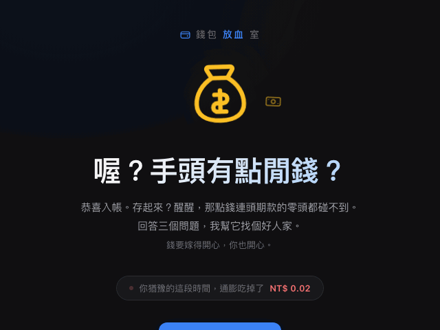
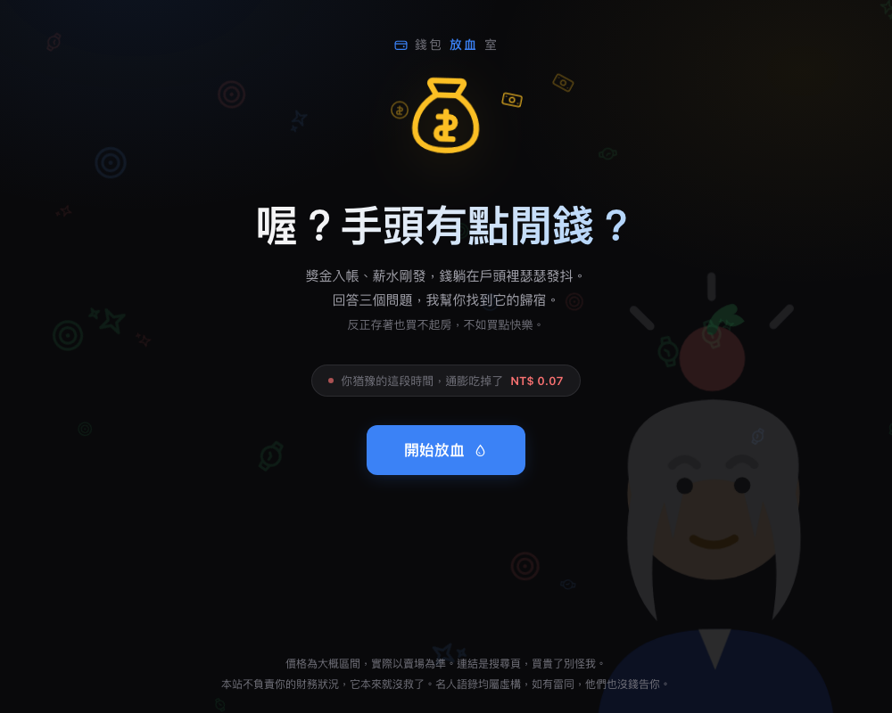
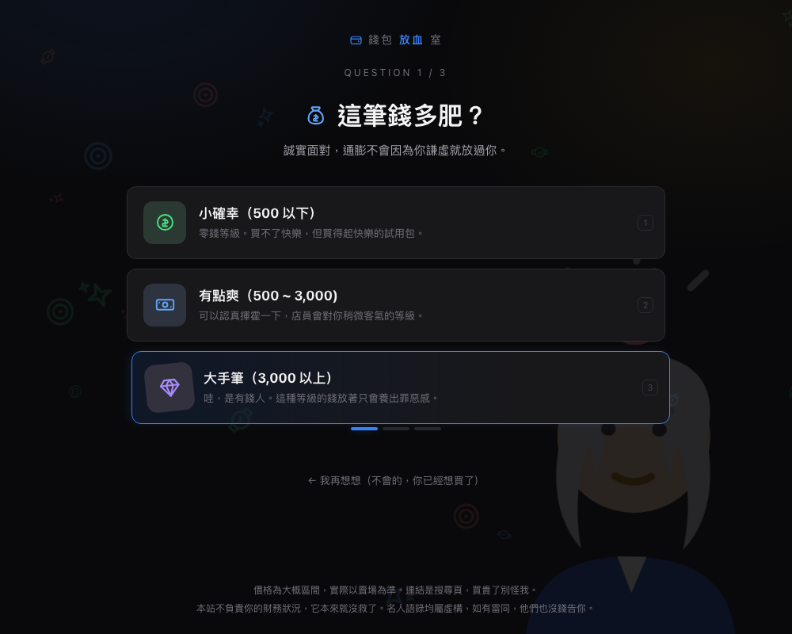
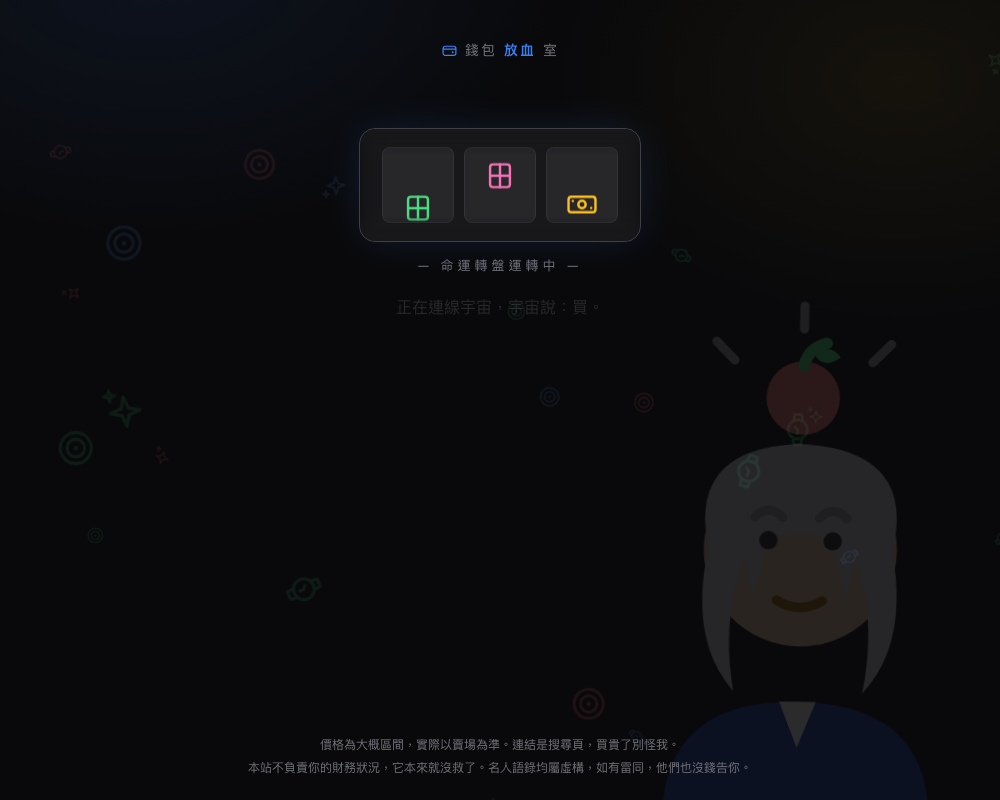
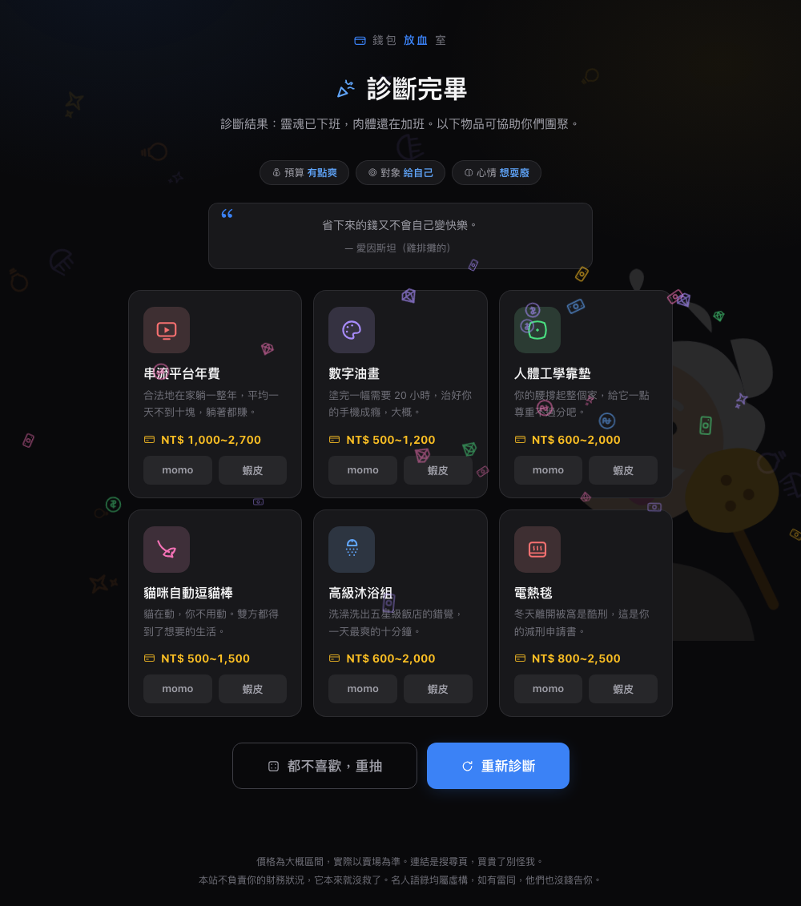
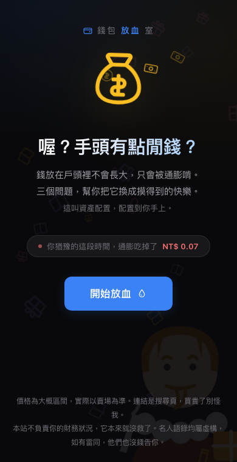

# 錢包放血室 💸

> 反正錢留著也會貶值。

剛領到獎金或薪水,想花點小錢又不知道花在哪?回答三個問題,厭世小助手幫你把錢安排得明明白白。

**線上玩:https://spend-it-hazel.vercel.app**

純靜態單頁(HTML/CSS/JS),零依賴、零 build、零後端。開 `index.html` 就能跑。

*首頁 → 三題漏斗 → 拉霸機 → 診斷結果 → 重抽,一鏡到底。*

---

## 長這樣

### 首頁 — 通膨計數器現場直播

進站先看著自己的錢被通膨啃。右下角是輪播的手繪名人(這位是牛頓,頭上有蘋果),背景飄的是他的主題元素雨,十秒換一位。

### 三題漏斗 — 預算 → 對象 → 心情

每題三個選項,句句戳心。支援鍵盤 1 / 2 / 3 快選,Esc 回上一題。

### 命運轉盤 — 拉霸機過場

答完題不直接給答案,先讓三軸拉霸機轉一下,配一句隨機的載入語,像「正在連線宇宙,宇宙說:買。」

### 診斷結果 — 商品卡 + 假名人背書

依你的選擇出最多六張商品卡:自製 SVG 圖示、主題色、厭世描述、價格帶、momo / 蝦皮搜尋連結。上方附一句假名人語錄(「省下來的錢又不會自己變快樂。— 愛因斯坦(雞排攤的)」),抽到誰的語錄,背景就浮出誰。

「重抽」保證全新卡片,絕不洗同一批 — 精準命中池抽完換同價位帶,再抽完擴大到全目錄,45 樣全看完才重置,還會被吐槽「錢是有多難花?」。

### 手機版

場景自動調淡、卡片單欄,躺著也能放血。

---

## 特色

- **45 樣精選商品**,分三個價格帶(<500 / 500~3,000 / 3,000+),每樣都有手工畫的 24×24 線條風 SVG 圖示 — 全站零 emoji、零圖片檔
- **手繪名人背景**:巴菲特(珍奶)、愛因斯坦(雞排)、莎士比亞(蝦皮包裹)、蘇格拉底(蔥籃)、牛頓(蘋果),全是 inline SVG
- **文案全隨機池**:首頁副標、診斷結果、載入語、重抽吐槽、名人語錄,每次來都不太一樣

## 免責聲明

價格為大概區間,連結是搜尋頁,買貴了別怪我。名人語錄均屬虛構,如有雷同,他們也沒錢告你。本站不負責你的財務狀況 — 它本來就沒救了。
